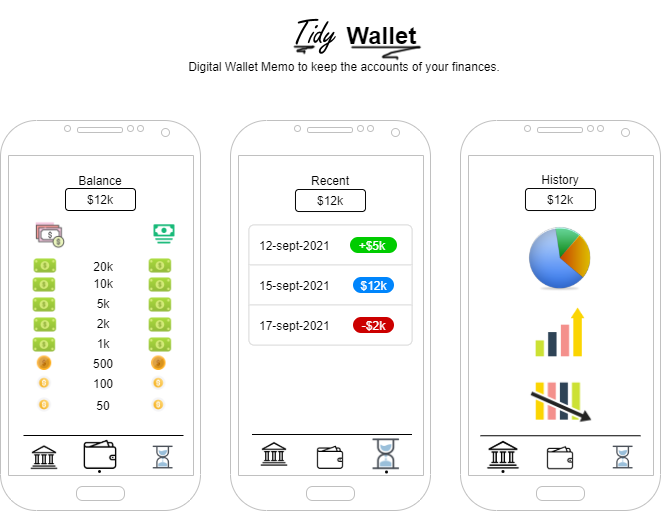

# 💸 Chary Wallet 💰

[](https://github.com/vuejs/vue)
[](https://github.com/vuejs/vue)
[](https://github.com/vuejs/vue)

<p align="center">
  <a href="./docs/img/Chary-Wallet.drawio.png" rel="noopener">
    
  </a>
</p>

Digital Wallet Memo to keep the accounts of your finances. 💸💰👛

## 📝 Table of Contents 📂

- [About](#about)
- [Getting Started](#getting_started)
- [Prerequisites](#prerequisites)
- [Installing](#installing)
- [Usage](#usage)
- [Contributing](../CONTRIBUTING.md)
- [Build Using](#built_using)
- [Authors](#authors)
- [Acknowledgments](#acknowledgement)

## 🧐 About <a name = "about"></a>

Digital Wallet Memo to keep the accounts of your finances. 💸💰

## 🏁 Getting Started <a name = "getting_started"></a>

These instructions will get you a copy of the project up and running on your local machine for development and testing purposes. See [deployment](#deployment) for notes on how to deploy the project on a live system.

### 📘 Prerequisites <a name = "prerequisites"></a>

Install Node and Vue CLI to run the project on LocalHost.

```bash
npm install -g vue
```

###  🔧 Installing <a name = "installing"></a>

#### Project setup
```
npm install
```

##### Compiles and hot-reloads for development
```
npm run serve
```

##### Compiles and minifies for production
```
npm run build
```

##### Lints and fixes files
```
npm run lint
```

##### Customize configuration
See [Configuration Reference](https://cli.vuejs.org/config/).


## 🎈 Usage <a name = "usage"></a>

Just click the buttons and see the magic.

## 🚀 Deployment <a name = "deployment"></a>

It's recommended to clone **index.html** as **404.html** when deploying to GitHub Pages.

## ⛏️ Built Using <a name = "built_using"></a>

- ~~[MongoDB](https://www.mongodb.com/) - Database~~
- ~~[Express](https://expressjs.com/) - Server Framework~~
- [VueJS](https://vuejs.org/) - Web Framework
- ~~[NodeJs](https://nodejs.org/en/) - Server Environment~~

## ✍️ Authors 👌 <a name = "authors"></a>

- 🗿 [@Marfullsen](https://github.com/Marfullsen) - Idea, Initial work, all work.

See also the list of [contributors](./contributors) who participated in this project.

## 🎉 Acknowledgements <a name = "acknowledgement"></a>

- [All Emojis](https://github.com/scotch-io/All-Github-Emoji-Icons)
- [VsCode Readme Ext](https://github.com/thomascsd/vscode-readme-pattern)
